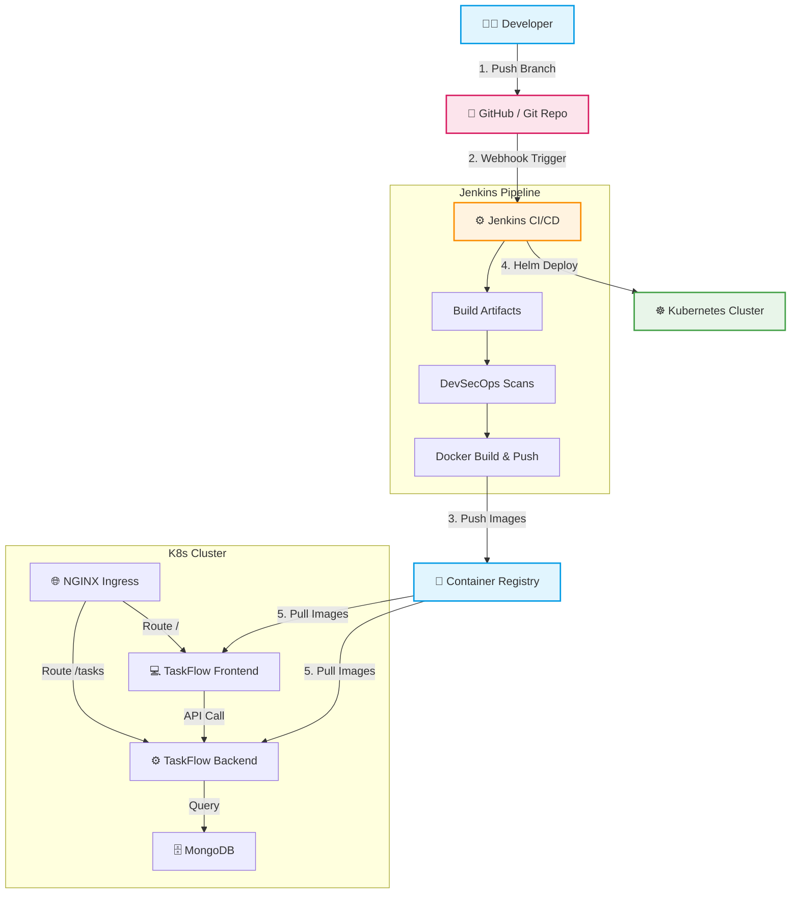
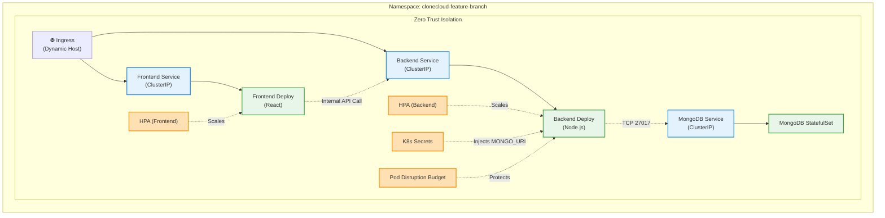
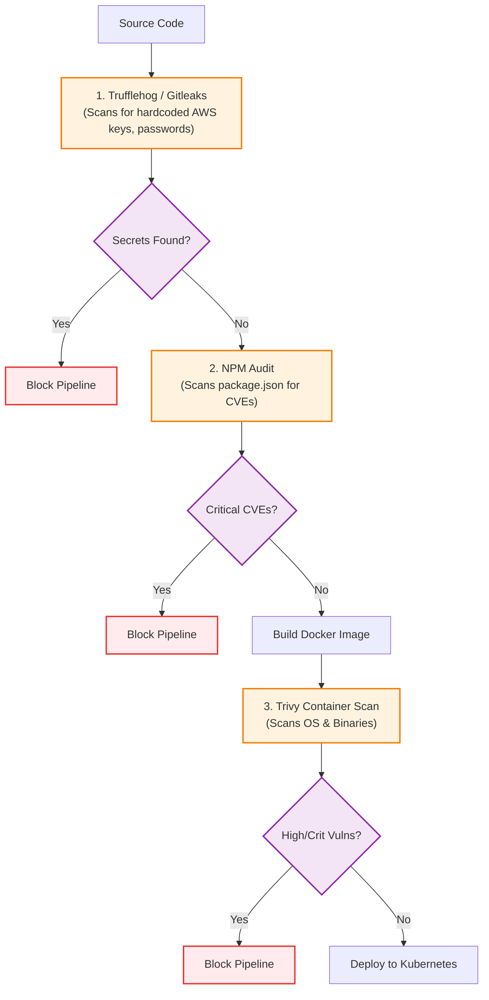
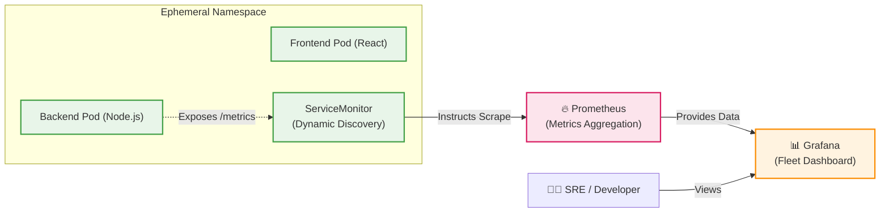
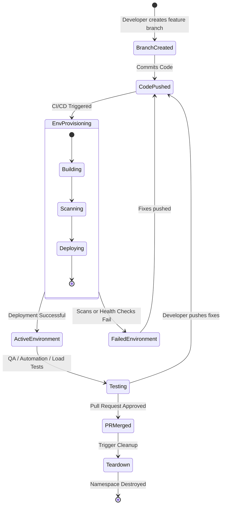
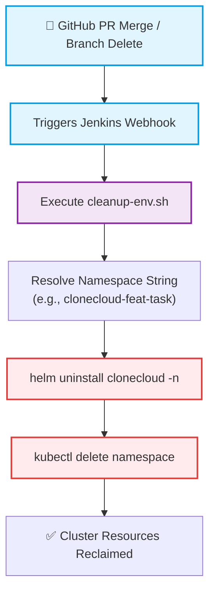

# CloneCloud Architecture Diagrams & Explanations

This document contains publication-quality Mermaid diagrams detailing the architecture of the CloneCloud DevSecOps Platform. These diagrams are designed for use in university reports and viva defenses.

## 1. High-Level System Architecture

This diagram illustrates the macro-level flow of the CloneCloud platform, from a developer's local environment through the CI/CD pipeline to the final ephemeral environment in Kubernetes.

**Explanation**: 
The high-level architecture demonstrates the GitOps-inspired workflow. A developer pushes code to a feature branch, triggering Jenkins. Jenkins orchestrates the build, executes security scans, builds container images, and pushes them to a registry. Finally, Jenkins dynamically provisions an ephemeral namespace in the Kubernetes cluster using Helm, deploying the microservice application consisting of a React frontend, Node.js backend, and MongoDB database.

---

## 2. CI/CD Pipeline Architecture

This diagram details the internal stages of the `Jenkinsfile` pipeline, emphasizing the strict progression from initialization to verification.

```mermaid
graph LR
    classDef stage fill:#f3e5f5,stroke:#8e24aa,stroke-width:2px;
    classDef sec fill:#ffebee,stroke:#e53935,stroke-width:2px;
    classDef deploy fill:#e8f5e9,stroke:#43a047,stroke-width:2px;

    Start((Start)) --> Init["Initialize & Metadata"]:::stage
    Init --> SecScan["Secret Scanning<br/>(Trufflehog)"]:::sec
    SecScan --> DepScan["Dependency Scan<br/>(npm audit)"]:::sec
    DepScan --> Build["Build Images<br/>(Backend/Frontend)"]:::stage
    Build --> ImgScan["Container Scan<br/>(Trivy)"]:::sec
    ImgScan --> Push["Push Images<br/>(Registry)"]:::stage
    Push --> HelmDeploy["Deploy to K8s<br/>(Helm Upgrade)"]:::deploy
    HelmDeploy --> Verify["Verify Rollout Status"]:::deploy
    Verify -->|Failure| Rollback["Automated Rollback"]:::sec
    Verify -->|Success| LoadTest["Load Testing<br/>(k6)"]:::stage
    LoadTest --> End((End))
```

**Explanation**: 
The CI/CD pipeline enforces a "shift-left" security paradigm. If secret scanning, dependency scanning, or container image scanning fails, the pipeline halts immediately, preventing insecure code from reaching Kubernetes. Once deployed, the pipeline explicitly checks the rollout status. If health checks fail, an automated rollback is triggered. Upon success, post-deployment load testing validates performance.

---

## 3. Kubernetes Deployment Architecture

This diagram explores the internal topology of a dynamically generated ephemeral namespace, highlighting Kubernetes hardening features.

**Explanation**: 
Within the ephemeral namespace, the architecture leverages advanced Kubernetes constructs. Traffic enters via an Ingress configured with a dynamic, branch-specific URL. Services route traffic to Deployments. The environment is fortified with Horizontal Pod Autoscalers (HPA) for load management, Pod Disruption Budgets (PDB) for high availability during cluster maintenance, and strict Network Policies enforcing zero-trust communication between the microservices. Secrets are securely injected rather than hardcoded.

---

## 4. Security Pipeline Architecture (DevSecOps)

This diagram focuses specifically on the security layers implemented to ensure "secure-by-design" deployments.

**Explanation**: 
The DevSecOps pipeline implements three distinct security gates. First, static repository analysis checks for leaked secrets. Second, dependency analysis checks for vulnerable open-source libraries. Third, after the artifact is compiled, the container image itself is scanned for OS-level vulnerabilities. Failing any of these checks blocks the deployment, acting as a crucial defense mechanism.

---

## 5. Monitoring Architecture

This diagram shows how metrics are scraped and visualized for ephemeral environments.

**Explanation**: 
To monitor rapidly changing ephemeral environments, CloneCloud uses the Prometheus Operator. A `ServiceMonitor` is deployed alongside the application in the Helm chart. Prometheus automatically discovers this new `ServiceMonitor` and begins scraping metrics from the backend pods. These metrics are then dynamically populated into a centralized Grafana dashboard designed to handle fleet-wide metrics.

---

## 6. Branch Lifecycle Architecture

This state diagram models the lifecycle of an ephemeral environment tied to a Git branch.

**Explanation**: 
The lifecycle begins when a developer pushes a branch. The environment transitions to a provisioning state where building and scanning occur. Once active, the environment is used for QA and load testing. Iterative pushes update the environment. Crucially, the lifecycle definitively ends when the Pull Request is merged, triggering a teardown that reclaims all cluster resources.

---

## 7. Cleanup Workflow Architecture

This flowchart details the precise automation sequence for reclaiming cluster resources.

**Explanation**: 
To prevent "cluster sprawl" (orphaned environments consuming expensive cloud resources), a rigid cleanup workflow is implemented. A branch deletion or PR merge event triggers a dedicated CI job that runs `cleanup-env.sh`. This script safely uninstalls the Helm release, ensuring clean deletion of persistent volume claims and ingresses, and finally deletes the namespace entirely.
